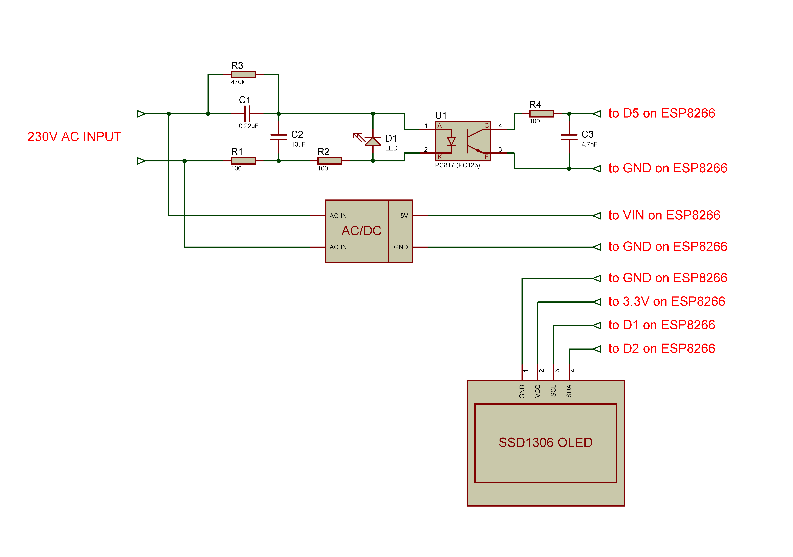

# DIY Device that Monitors the Power Grid of the Entire Country

This is the video how I built this device:
https://youtu.be/diqaiXGB9Js

This is the final curcuit:

# Components

ESP8266: [https://s.click.aliexpress.com/e/_97j7kp](https://s.click.aliexpress.com/e/_De5gu7f)

Display SSD1306 [https://s.click.aliexpress.com/e/_Dn3VDrB](https://s.click.aliexpress.com/e/_DlKJDvf)

Optocoupler PC817: [https://s.click.aliexpress.com/e/_Dnbd5jn](https://s.click.aliexpress.com/e/_Dnbd5jn)

5V Power Supply: [https://s.click.aliexpress.com/e/_DEBljk9](https://s.click.aliexpress.com/e/_DEBljk9)

# Other usefull components for this project:

Ceramic Capacitors: [https://s.click.aliexpress.com/e/_ABg3GZ](https://s.click.aliexpress.com/e/_ABg3GZ)

Resistors: [https://s.click.aliexpress.com/e/_9AslPB](https://s.click.aliexpress.com/e/_9AslPB)

Pin Header: [https://s.click.aliexpress.com/e/_AUvLzT](https://s.click.aliexpress.com/e/_DdOig6l)

Female PCB Header: [https://s.click.aliexpress.com/e/_AClQip](https://s.click.aliexpress.com/e/_DDBKykp)

My Oscilloscope: [https://s.click.aliexpress.com/e/_Dm5XU21](https://s.click.aliexpress.com/e/_Dm5XU21)

But I want this oscilloscope: [https://s.click.aliexpress.com/e/_DlB41jL](https://s.click.aliexpress.com/e/_DlB41jL)
